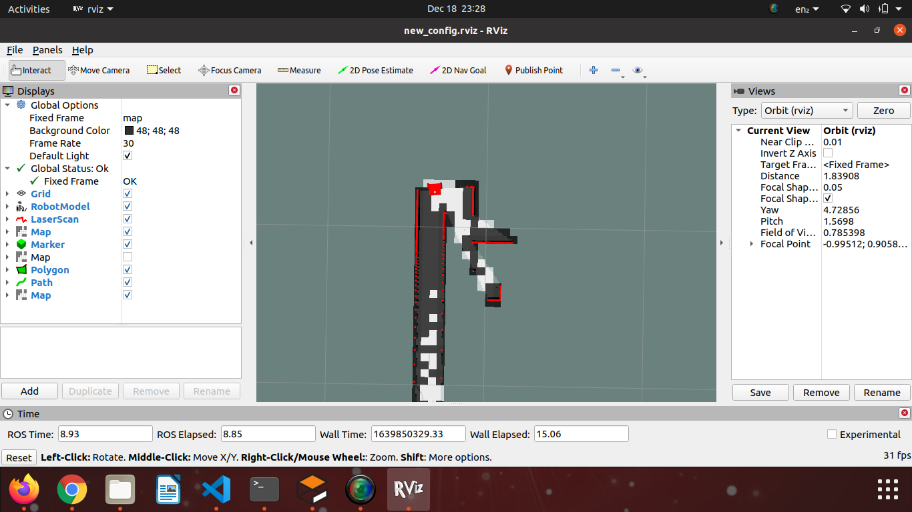
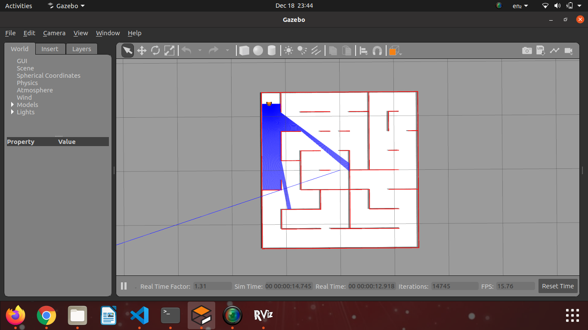

# Micromouse_challenge

## Simulation of Techfest's Micromouse Challenge

I am CHAHAK JETHANI, a student of IIT(BHU) VARANASI. I attempted to the micromouse challenge. As I was alone in this competition, therefore I was not able to do much. 

I tried to implement two of the open source ROS packages which are:-
        1) Exploration Lite
        2) Frontier exploration

Both of the packages posed the same major problems which I was not able to solve even till the last moment. The inflation radius of Costmap was quite high and some parameters had to be adjusted to solve the issue. I was working alone and so not able to solve this problem

The problem with costmap :-

Also another issue was correcting the parameters of move base. The bot was able to move but it's speed was quite slow in exploration lite and it was moving only a little in frontier exploration.

Now I first tried to implement this a more easier map. Therefore I knew that some parameters had to changed in both move_base params and costmap2d params

The easy map that I was using to improve parameters of move base :-

The working of exploration lite :-

        <iframe width="560" height="315" src="https://www.youtube.com/embed/QdUkaSucpjA?start=4" title="YouTube video player" frameborder="0" allow="accelerometer; autoplay; clipboard-write; encrypted-media; gyroscope; picture-in-picture" allowfullscreen></iframe>

The working of frontier exploration :-

        <iframe width="560" height="315" src="https://www.youtube.com/embed/nD7x1MrnupU" title="YouTube video player" frameborder="0" allow="accelerometer; autoplay; clipboard-write; encrypted-media; gyroscope; picture-in-picture" allowfullscreen></iframe>

This competition is over but still if you want to collaborate on this project you can contact me at chahakjethani@gmail.com

